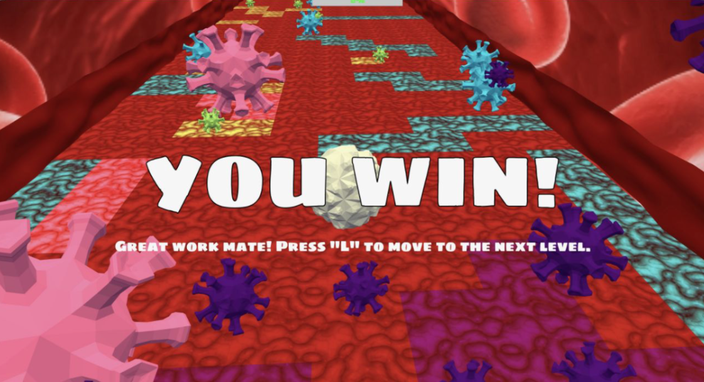

# GOING VIRAL Web Game

Welcome! This is the source code for a Covid-19 themed, arcade-type web game I built with a couple friends while remote learning during our junior year of undergrad. 

You, the player, are a healthy white blood cell trying to avoid infection by enemy virus particles. As you progress through each level, the game increases in difficulty, challenging you to be more daring. Use your arrow keys to "run" and space bar to jump your way to success! 

[Check it out!](https://hyunsunk99.github.io/going-viral/)

## Motivation
Our project was designed to provide light-hearted relief and entertainment as so many around the world were cooped up indoors in the spring of 2020. Our game takes inspiration from a number of "runner" type games we loved as kids, such as Subway Surfers and Temple Run. We hope you enjoy! 

## Approach
Our app is built primarily on [Three.js](https://threejs.org/) for cross-browser reliable 3D rendering, as well as the [Cannon.js](https://schteppe.github.io/cannon.js/) 3D physics engine. 

For more details on our approach, methods, and contributions, see our [final paper](https://github.com/hyunsunk99/going-viral/blob/master/COS%20426_%20Final%20Write%20Up.pdf).